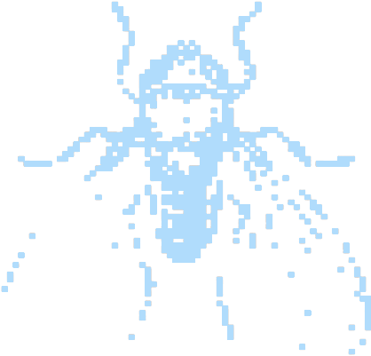

<p align="center">
  
  
  
</p>

<h1 align="center">  GS FIAP Monitor</h1>

> **Sistema web para monitorar sensores (umidade, temperatura, nível de água) via ESP32 e Fiware. Interface moderna, responsiva e com gráficos interativos.**

---

## Membros do Grupo:
- [Gabriel Couto Ribeiro](https://github.com/rouri404) -
  <a href="https://www.linkedin.com/in/gabricouto/">
    
  </a>
- [Gabriel Kato Peres](https://github.com/kato8088) -
  <a href="https://www.linkedin.com/in/gabrikato/">
    
  </a>
- [João Vitor de Matos](https://github.com/joaomatosq) -
  <a href="https://www.linkedin.com/in/joaomatosq/">
    
  </a>

---

## 🚀 Funcionalidades

| Funcionalidade                | Descrição                                                                                                |
|-------------------------------|----------------------------------------------------------------------------------------------------------|
| 📡 Integração Fiware          | Recebe e busca dados de sensores do Orion Context Broker.                                                  |
| 📋 Listagem de Dispositivos   | Exibe dispositivos em cards com status, últimas leituras e links. Oferece detecção automática e guia manual. |
| 📈 Gráficos Interativos       | Mostra histórico de leituras com Plotly.                                                                 |
| 🗺️ Mapa Interativo            | Localiza dispositivos no mapa com marcadores de status e popups informativos.                            |
| 📍 Edição de Localização      | Permite editar coordenadas de dispositivos (atualiza no Fiware).                                         |
| ✨ Detecção Automática        | Busca e cadastra novos dispositivos do Fiware.                                                           |
| 🔋 Status Operacional         | Indica se dispositivos estão Online ou Offline.                                                          |
| 🔒 Administração              | Gerenciamento via Django Admin.                                                                          |
| 🎨 Visual Moderno             | Interface responsiva com TailwindCSS.                                                                    |

---

## 📦 Modelos de Dados

| Modelo           | Campos Principais                                                                    |
|------------------|--------------------------------------------------------------------------------------|
| **Dispositivo**  | nome, id_fiware, latitude, longitude, descricao, data_criacao, ativo                 |
| **TipoSensor**   | nome, unidade_medida, descricao                                                      |
| **LeituraSensor**| dispositivo (FK), tipo_sensor (FK), valor, timestamp_leitura, timestamp_recebimento |

---

## 🛠️ Tecnologias Utilizadas

| Tecnologia         | Versão    | Descrição                                           |
|--------------------|-----------|-----------------------------------------------------|
| Django             | 5.2.1     | Framework web backend                               |
| Django REST        | 3.16.0    | Para APIs REST                                      |
| Plotly             | 6.1.2     | Gráficos interativos                                |
| Pandas             | 2.2.3     | Manipulação de dados                                |
| Prophet            | 1.1.7     | Previsão (planejado/não implementado)               |
| Scikit-learn       | 1.6.1     | Machine Learning (planejado/não implementado)       |
| Leaflet.js         | (via CDN) | Mapas interativos                                   |
| TailwindCSS        | -         | Estilização moderna                                 |

---

## ⚙️ Instalação e Execução

1. **Clone o repositório**
   ```bash
   git clone https://github.com/rouri404/site-gs-fiap.git
   cd site-gs-fiap
   ```
2. **Crie e ative um ambiente virtual**
   ```bash
   python -m venv venv
   source venv/bin/activate  # Linux/Mac
   venv\Scripts\activate   # Windows
   ```
3. **Instale as dependências**
   ```bash
   pip install -r requirements.txt
   ```
4. **Aplique as migrações**
   ```bash
   python gs_fiap_monitor/manage.py migrate
   ```
5. **Colete todos os arquivos estáticos**
   ```bash
   python gs_fiap_monitor/manage.py collectstatic
   ```
6. **Crie um superusuário (opcional, para admin)**
   ```bash
   python gs_fiap_monitor/manage.py createsuperuser
   ```
7. **Execute o servidor**
   ```bash
   python gs_fiap_monitor/manage.py runserver
   ```
8. **Acesse**
   - Sistema: [http://localhost:8000/sensores/](http://localhost:8000/sensores/) (ou a URL da página inicial, `/`)
   - Admin: [http://localhost:8000/admin/](http://localhost:8000/admin/)


### 📂 Servindo Arquivos Estáticos (com DEBUG = False)

Para que os arquivos estáticos (CSS, JS, imagens, incluindo os do painel admin) funcionem corretamente quando `DEBUG = False` no `settings.py`, este projeto utiliza **WhiteNoise**.

**Pontos Chave:**

1.  **WhiteNoise:** Está configurado no `MIDDLEWARE` e `STATICFILES_STORAGE` em `gs_fiap_monitor/settings.py` para gerenciar os arquivos estáticos. As dependências (`whitenoise`, `brotlipy`) estão no `requirements.txt`.
2.  **Comando Essencial:** Sempre que houver alterações nos arquivos estáticos ou se o CSS/JS do admin não carregar, execute:
    ```bash
    python gs_fiap_monitor/manage.py collectstatic
    ```
    Isso garante que todos os arquivos estáticos sejam coletados no diretório `STATIC_ROOT` (definido em `settings.py`) para que o WhiteNoise possa servi-los.

---

### 🧹 Limpar Dados do Banco (Desenvolvimento)

**Atenção:** Remove todos os dados, mas mantém as tabelas.

1.  Pare o servidor.
2.  Execute: `python gs_fiap_monitor/manage.py flush` (confirme com `yes`).
3.  (Opcional) Crie um superusuário: `python gs_fiap_monitor/manage.py createsuperuser`.
4.  (Opcional) Popule com dados de teste (veja seção abaixo).

---

## 🔗 Integração com Fiware

-   **Endpoint de Notificações:** `/sensores/fiware_notification/` (recebe dados do Fiware).
-   **Dados ao Vivo:** Detalhes do dispositivo buscam informações atuais do Fiware.

**Importante:** Seu Orion Context Broker deve:
1.  Estar acessível pela aplicação Django.
2.  Enviar notificações NGSI v2 para `http://<SEU_HOST_DJANGO>:<PORTA>/sensores/fiware_notification/`.

### Exemplo de Payload de Notificação (NGSI v2)

```json
{
  "subscriptionId": "id_da_sua_inscricao",
  "data": [
    {
      "id": "urn:ngsi-ld:SensorDevice:001",
      "type": "SensorDevice",
      "temperature": {"value": 23.5, "type": "Number", "metadata": {"unitCode": {"value": "CEL"}}},
      "humidity": {"value": 60, "type": "Number", "metadata": {"unitCode": {"value": "P1"}}},
      "waterLevel": {"value": 45, "type": "Number", "metadata": {"unitCode": {"value": "P1"}}},
      "TimeInstant": {"value": "2025-06-01T12:00:00.000Z", "type": "DateTime"} 
    }
  ]
}
```
*Nota: `TimeInstant` (ou `timestamp`) na entidade define a hora da leitura. `unitCode` nos metadados define a unidade.*

---

## 📊 Visualização

| Página       | Descrição                                                       |
|--------------|-----------------------------------------------------------------|
| **Listagem** | Cards de dispositivos com status, leituras e geolocalização.    |
| **Detalhes** | Informações completas, dados ao vivo e gráficos de histórico.   |
| **Mapa**     | Dispositivos no mapa com marcadores de status e popups.         |
| **Admin**    | Gerenciamento de dispositivos, sensores e leituras.             |

---

## 🧑‍💻 Contribuição

1.  Fork o projeto.
2.  Crie uma branch (`git checkout -b feature/sua-feature`).
3.  Commit suas alterações (`git commit -am 'feat: nova feature'`).
4.  Push (`git push origin feature/sua-feature`).
5.  Abra um Pull Request.

---

## 🛰️ Adicionar Dispositivos ESP32

O sistema pode detectar dispositivos automaticamente (`Detectar Novos Dispositivos` na listagem).

Para adicionar manualmente:
1.  Acesse o **Painel Admin** (`http://localhost:8000/admin/`).
2.  Vá em **Dispositivos** e clique em **Adicionar Dispositivo**.
3.  **Campos importantes:**
    *   **ID Fiware:** ID exato do seu dispositivo no Fiware (ex: `urn:ngsi-ld:SensorDevice:001`). **Crucial para a comunicação.**
    *   **Nome do Dispositivo:** Nome.
    *   **Latitude/Longitude:** Para o mapa.
    *   **Ativo:** Marque para habilitar.
4.  Salve.

### Exemplo: Via Django Shell (para desenvolvimento/testes)

Você também pode adicionar/atualizar dispositivos programaticamente usando o Django shell. Isto é útil para scripts de setup ou testes.

1.  Abra o shell:
    ```bash
    python gs_fiap_monitor/manage.py shell
    ```

2.  Execute um script similar a este (ajuste os valores conforme necessário):
    ```python
    from sensores.models import Dispositivo

    # Exemplo para criar ou atualizar um dispositivo:
    obj, criado = Dispositivo.objects.update_or_create(
        id_dispositivo_fiware='urn:ngsi-ld:SensorDevice:00X',  # Identificador único do dispositivo no Fiware
        defaults={
            'nome_dispositivo': 'Sensor Exemplo Alpha',
            'localizacao_latitude': -23.5880, # Opcional: Coordenadas para o mapa
            'localizacao_longitude': -46.6590, # Opcional
            'descricao': 'Configurado via shell.', # Opcional
            'ativo': True # Define se o dispositivo está operacional no sistema
        }
    )

    if criado:
        print(f"Dispositivo 'Sensor Exemplo Alpha' (urn:ngsi-ld:SensorDevice:00X) CRIADO.")
    else:
        print(f"Dispositivo 'Sensor Exemplo Alpha' (urn:ngsi-ld:SensorDevice:00X) ATUALIZADO.")

    # Dica: Para adicionar múltiplos dispositivos, você pode chamar 
    # Dispositivo.objects.update_or_create(...) repetidamente com dados diferentes,
    # ou criar uma lista de dicionários e iterar sobre ela.
    ```

---

## 🧪 Popular Banco com Dados Fictícios (Teste)

Para testes, use os comandos abaixo no terminal (na pasta do projeto) para criar leituras para um dispositivo com ID `urn:ngsi-ld:SensorDevice:001`. Ajuste o ID se necessário.

**Temperatura:**
```bash
python gs_fiap_monitor/manage.py shell -c "from sensores.models import Dispositivo, TipoSensor, LeituraSensor; from django.utils import timezone; from datetime import timedelta; device_id='urn:ngsi-ld:SensorDevice:001'; disp=Dispositivo.objects.get(id_dispositivo_fiware=device_id); tipo,_=TipoSensor.objects.get_or_create(nome='temperature',defaults={'unidade_medida':'CEL','descricao':'Sensor de temperatura'}); [LeituraSensor.objects.create(dispositivo=disp,tipo_sensor=tipo,valor=20+i,timestamp_leitura=timezone.now()-timedelta(hours=i)) for i in range(5)]"
```

**Umidade:**
```bash
python gs_fiap_monitor/manage.py shell -c "from sensores.models import Dispositivo, TipoSensor, LeituraSensor; from django.utils import timezone; from datetime import timedelta; device_id='urn:ngsi-ld:SensorDevice:001'; disp=Dispositivo.objects.get(id_dispositivo_fiware=device_id); tipo,_=TipoSensor.objects.get_or_create(nome='humidity',defaults={'unidade_medida':'P1','descricao':'Sensor de umidade'}); [LeituraSensor.objects.create(dispositivo=disp,tipo_sensor=tipo,valor=50+i*2,timestamp_leitura=timezone.now()-timedelta(hours=i)) for i in range(5)]"
```

**Nível de água:**
```bash
python gs_fiap_monitor/manage.py shell -c "from sensores.models import Dispositivo, TipoSensor, LeituraSensor; from django.utils import timezone; from datetime import timedelta; device_id='urn:ngsi-ld:SensorDevice:001'; disp=Dispositivo.objects.get(id_dispositivo_fiware=device_id); tipo,_=TipoSensor.objects.get_or_create(nome='waterLevel',defaults={'unidade_medida':'P1','descricao':'Sensor de nível de água'}); [LeituraSensor.objects.create(dispositivo=disp,tipo_sensor=tipo,valor=30+i*5,timestamp_leitura=timezone.now()-timedelta(hours=i)) for i in range(5)]"
```
*Estes comandos criam 5 leituras retroativas para cada sensor, facilitando testes com gráficos.*
